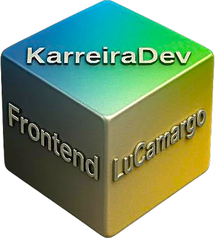

<p align="center">
  
</p>

# 🌐 Landing Page Responsiva - KarreiraDev | LuCamargo

[]() 
[]() 
[]() 
[]() 
[]()  
[]() 
[]() 
[]()  

Este projeto é uma **Landing Page responsiva** desenvolvida para servir como portfólio e vitrine profissional, apresentando **habilidades, serviços e projetos** em **desenvolvimento frontend**.  
O objetivo é oferecer um layout moderno, funcional e otimizado para dispositivos móveis e desktops.  

---

## 🚀 Tecnologias Utilizadas

- **HTML5** → Estrutura semântica do projeto.  
- **CSS3** → Estilização personalizada, incluindo responsividade.  
- **JavaScript (ES6+)** → Interatividade e dark/light mode.  
- **Tailwind CSS** → Utilização de classes utilitárias para acelerar o design responsivo.  
- **Bootstrap** → Grid system e responsividade adicional.  
- **Flowbite** → Componentes pré-estilizados baseados no Tailwind.  
- **Font Awesome** → Ícones vetoriais de fácil integração.  
- **Flaticon** → Ícones adicionais para enriquecer a UI.  

---

## 🎨 Recursos Principais

- ✅ **Responsividade completa** (desktop, tablet e mobile).  
- ✅ **Modo claro/escuro** com toggle.  
- ✅ **Navbar fixa** e adaptativa.  
- ✅ **Seções organizadas**: Home, Sobre, Serviços, Equipe, Planos e Contato.  
- ✅ **Uso de imagens otimizadas** no formato **WEBP**.  
- ✅ **Design moderno e profissional**, com foco em UI/UX.  

---

## 📂 Estrutura de Pastas

<p align="center">
  
</p>

# 🌐 Landing Page Responsiva - KarreiraDev | LuCamargo

[]() 
[]() 
[]() 
[]() 
[]()  
[]() 
[]() 
[]()  

Este projeto é uma **Landing Page responsiva** desenvolvida para servir como portfólio e vitrine profissional, apresentando **habilidades, serviços e projetos** em **desenvolvimento frontend**.  
O objetivo é oferecer um layout moderno, funcional e otimizado para dispositivos móveis e desktops.  

---

## 🚀 Tecnologias Utilizadas

- **HTML5** → Estrutura semântica do projeto.  
- **CSS3** → Estilização personalizada, incluindo responsividade.  
- **JavaScript (ES6+)** → Interatividade e dark/light mode.  
- **Tailwind CSS** → Utilização de classes utilitárias para acelerar o design responsivo.  
- **Bootstrap** → Grid system e responsividade adicional.  
- **Flowbite** → Componentes pré-estilizados baseados no Tailwind.  
- **Font Awesome** → Ícones vetoriais de fácil integração.  
- **Flaticon** → Ícones adicionais para enriquecer a UI.  

---

## 🎨 Recursos Principais

- ✅ **Responsividade completa** (desktop, tablet e mobile).  
- ✅ **Modo claro/escuro** com toggle.  
- ✅ **Navbar fixa** e adaptativa.  
- ✅ **Seções organizadas**: Home, Sobre, Serviços, Equipe, Planos e Contato.  
- ✅ **Uso de imagens otimizadas** no formato **WEBP**.  
- ✅ **Design moderno e profissional**, com foco em UI/UX.  

---

## 📂 Estrutura de Pastas

LANDING-PAGE-RESPONSIVA/
│── css/
│ ├── reset.css
│ ├── style.css
│
│── img/
│ ├── (imagens em formato .webp)
│
│── js/
│ ├── head.js
│ ├── script.js
│
│── index.html
│── .gitattributes


---

## ⚡ Como Executar o Projeto

1. Clone este repositório:
   ```bash
   git clone https://github.com/SEU-USUARIO/landing-page-responsiva.git

cd landing-page-responsiva

📸 Preview

👉 [Adicione aqui um link do GitHub Pages ou uma imagem do preview da landing page]

👨‍💻 Autor

LuCamargo - KarreiraDev
Desenvolvedor Frontend focado em criar interfaces modernas, responsivas e acessíveis.

🔗 Conecte-se comigo:

GitHub: @SEU-USUARIO

LinkedIn: [Seu LinkedIn]

📜 Licença

Este projeto está sob a licença MIT.
Sinta-se à vontade para usar, modificar e compartilhar 🚀